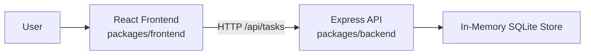
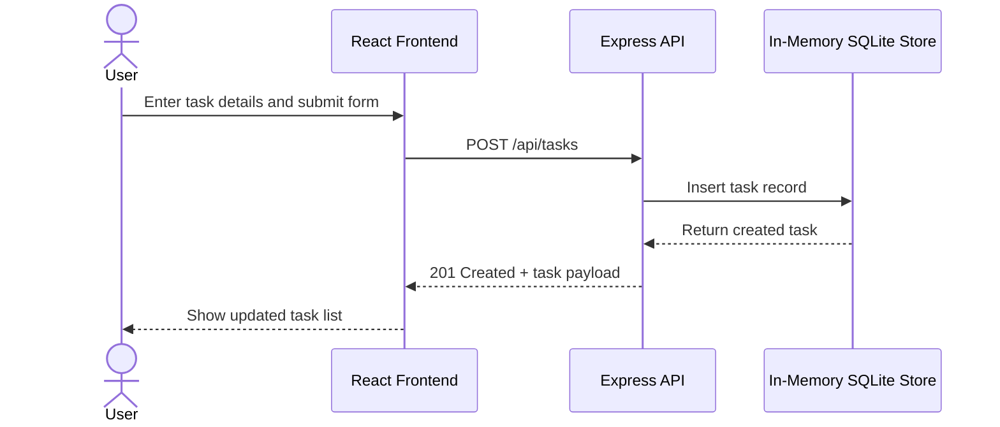

# Cloud Architecture Overview

This monorepo contains a React frontend that calls an Express API. The API manages task operations and stores data in an in-memory SQLite database.

## Create TODO Sequence

